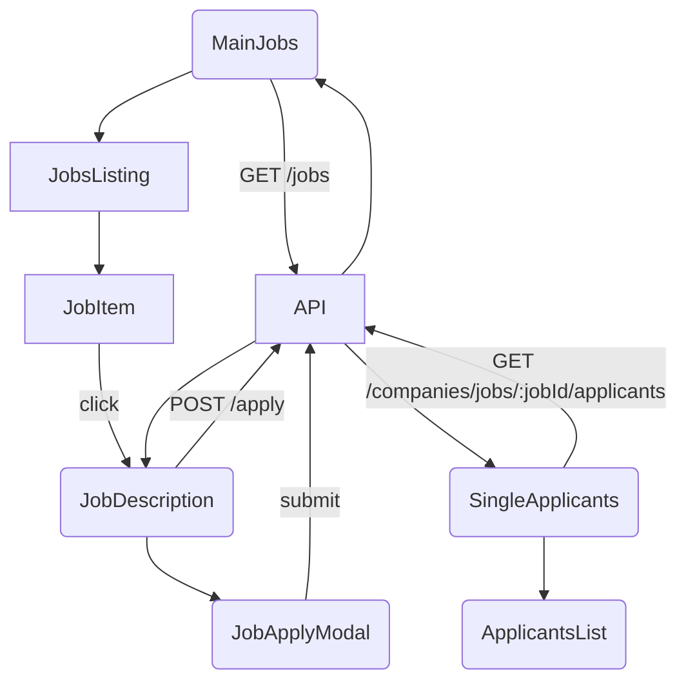

## Jobs Module — In-Depth Documentation

The **Jobs** module handles job discovery, detailed job views, and application workflows within TawasolApp. This document covers:

- Directory structure and purpose
- Core routing container
- Main jobs listing flow
- Job application workflow
- Detailed job view and applicant management
- Component breakdowns with props and state
- Data fetching, actions, and state transitions
- Testing and extension points

### 📁 Directory Structure
```
src/pages/Jobs/
├── JobsContainer.jsx            # Entry point: routes to listing or single job/applicants
├── SingleJob.jsx                # Dedicated view for a specific job
├── SingleApplicants.jsx         # View listing applicants for a job
├── JobsCompanyContainer.jsx     # Filters listings by company context
├── MainJobs/                    # Core listing and application UI
│   ├── MainJobs.jsx             # Manages job list state & infinite/page pagination
│   ├── JobsListing/             # Renders list of available jobs
│   │   ├── JobsListing.jsx      # Receives `jobs[]`, maps to JobItem
│   │   └── JobItem.jsx          # Displays summary card for each job
│   ├── JobDescription/          # Detailed job description view within listing
│   │   └── JobDescription.jsx   # Parses and renders full job details
│   ├── Apply/                   # Application modal
│   │   └── JobApplyModal.jsx    # Form for submitting job application
│   └── ApplicantsList/          # Optional inline view of applicants
│       └── ApplicantsList.jsx   # Searchable list of applicants for a job
└── GenericComponents/           # (If any shared UI, e.g., filters)
```

## Core Containers

#### JobsContainer.jsx
- **Role:** Determines which subview to render based on route:
  - `/jobs` → `<MainJobs filter={...} />`
  - `/jobs/:jobId` → `<SingleJob jobId={jobId} />`
  - `/jobs/:jobId/applicants` → `<SingleApplicants jobId={jobId} />`
- **Props:**
  - `filter`: may include `{ companyId?: string, location?: string }`
  - Pagination settings (pageSize)
- **Layout:** Optionally composes with `JobsCompanyContainer` for company-specific contexts.

#### JobsCompanyContainer.jsx
- **Role:** Wraps JobsContainer to scope listings by company ID from URL param.
- **Data Fetch:** On mount, verifies `companyId` exists; fetches company details for header/banner.

## Main Jobs Listing Flow

#### MainJobs/MainJobs.jsx
- **State:**
  ```ts
  interface MainJobsState {
    jobs: JobType[];
    loading: boolean;
    error: string | null;
    page: number;
    hasMore: boolean;
  }
  ```
- **Effects:**
  - On mount or when filter changes: reset `jobs`, `page=1`, call `fetchJobs(1)`.
  - Pagination: either infinite scroll or numbered pages via query param.
- **Methods:**
  - `fetchJobs(page)`: `GET /posts?type=jobs&companyId=...&page=&pageSize=`
  - `loadMore()`: append to `jobs` if `hasMore`.
- **Render:**
  ```jsx
  return (
    <>  
      <JobsListing jobs={jobs} />
      {loading && <Spinner />}
      {!hasMore && <EndOfList />}
    </>
  );
  ```

#### JobsListing/JobsListing.jsx
- **Props:** `jobs: JobType[]`
- **Function:** Maps `jobs.map(job => <JobItem key={job.jobId} job={job} />)`.

#### JobsListing/JobItem.jsx
- **Display:**
  - Position title, company name, location, experience level, salary range.
  - Posted date formatted via `date-fns` (e.g., "Posted 2 days ago").
- **Actions:**
  - Click on title navigates to `/jobs/{jobId}`.

## Job Detail & Application

#### JobDescription/JobDescription.jsx
- **Props:** `job: JobType` or fetches via `jobId` param.
- **Fetch:** If `job` prop missing, `GET /jobs/{jobId}` on mount.
- **Displays:** Full description, requirements, location, employment type.
- **Actions:**
  - "Apply" button opens `<JobApplyModal />`.

_Citation: Job description behavior_ citeturn2file0

#### Apply/JobApplyModal.jsx
- **Editor:** Form fields:
  - Cover letter (textarea)
  - Resume upload (file input)
  - Optionally LinkedIn profile link
- **State:** Controlled inputs with validation.
- **Submit:** `POST /jobs/{jobId}/apply` with form data.
- **Callbacks:** On success:
  - Close modal
  - Show toast notification
  - Increment applicant count locally in `MainJobsState`

## Applicant Management

#### SingleApplicants.jsx
- **Props:** `jobId`
- **Fetch:** `GET /companies/jobs/{jobId}/applicants?name=` on mount and on search changes.
- **State:** applicants array, loading, searchTerm.
- **Render:** searchable `ApplicantsList` component.

#### ApplicantsList/ApplicantsList.jsx
- **Props:** `applicants: ApplicantType[]`, `onSearch(term)` callback
- **Features:**
  - Input box to filter by name (debounced)
  - List each applicant: name, avatar, bio, application date

## Routing & Context

- **Routes configuration** in `ProtectedRoutes.jsx` maps:
  - `/jobs` → `JobsContainer`
  - `/jobs/:jobId` → `SingleJob`
  - `/jobs/:jobId/applicants` → `SingleApplicants`

- **Context:** No React Context; relies on local state per component and Redux for user auth.

## Data Flow Diagram



## Testing & Coverage
- All components under `src/pages/Jobs/` have Vitest tests in `src/tests/Jobs/...` covering:
  - Rendering with mock job data
  - Pagination and loading states
  - Modal open/close and form validation
  - API interactions via MSW mocks

## Extension Points

- **Filter Enhancements:** Add filters by location, salary, experience via a `JobsFilter` component.
- **Saved Jobs:** Integrate "Save Job" action toggling via API and update `JobItem` UI.
- **Company Branding:** Extend `JobItem` with company logo/avatar.
